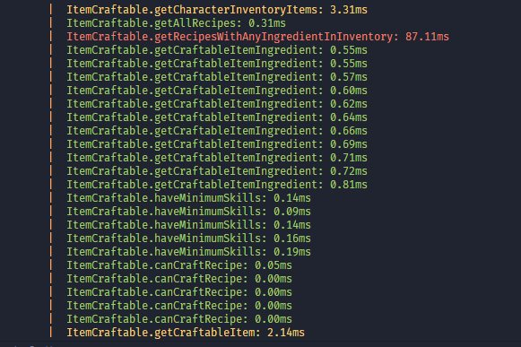

# Decorator Utils

This lib is a collection of useful decorators for debugging, logging and other utilities.

## Installation

```
yarn add @jonit-dev/decorators-utils -D
```

## Usage

### Loggers

#### @ClassLogger

This decorator will log the class name and the method name before the method execution.

```typescript

import { ClassLogger } from 'decorator-utils';

@ClassLogger()
export class SomeClassHere {
  public someMethodHere() {
    ...
  }
}
```

Would output something like:

```
 Running SomeClassHere.someMethodHere with arguments: [
  ...
  ]
```

### Performance Trackers



#### @TrackExecutionTime

This one is a method specific performance tracker. It will track the performance of the decorated method by using a console.time and console.timeEnd.

```typescript
import { TrackExecutionTime } from 'decorator-utils';

export class SomeClassHere {
  @TrackExecutionTime()
  public someMethodHere() {
    ...
  }
}
```

#### @TrackClassExecutionTime

This decorator will track the performance of all public and private methods of a class, by using a console.time and console.timeEnd.

```typescript
import { TrackClassExecutionTime } from 'decorator-utils';

@TrackClassExecutionTime()
export class SomeClassHere {
  ...
}
```

#### @DecorateAllWith(decorator)

As the name suggests, this decorator will decorate all methods of a class with the given decorator.

```typescript
import { DecorateAllWith } from 'decorator-utils';

@DecorateAllWith(TrackExecutionTime())
export class SomeClassHere {
  ...
}
```
